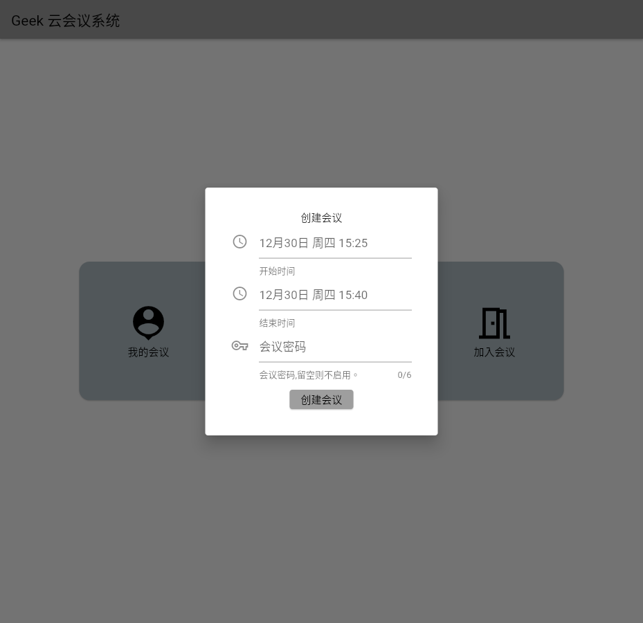

# Geek云视频会议项目开源仓库

## 项目简介
 * Geek云会议系统是一个基于webrtc的视频会议系统
 * 项目演示：[点击进入](https://meeting2.do18.cn/#/)
 * 平台支持

    * [x] Web
    * [ ] Android
    * [ ] Ios
    * [ ] Windows
    * [ ] Linux
 * 项目技术栈

    * 前端：Flutter
    * 后端：Go

## 项目截图

